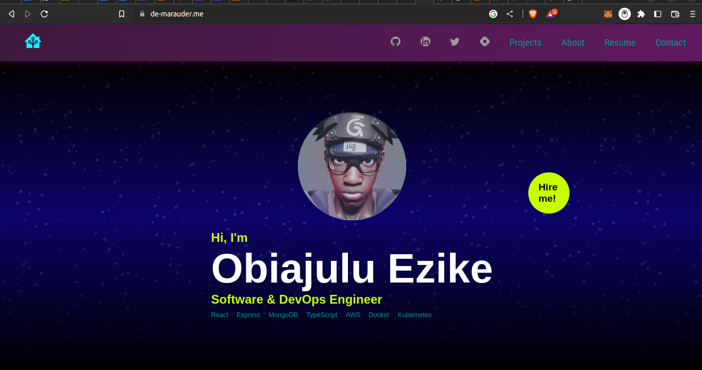
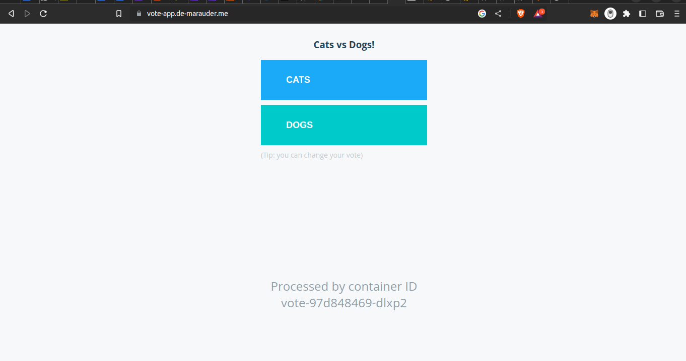
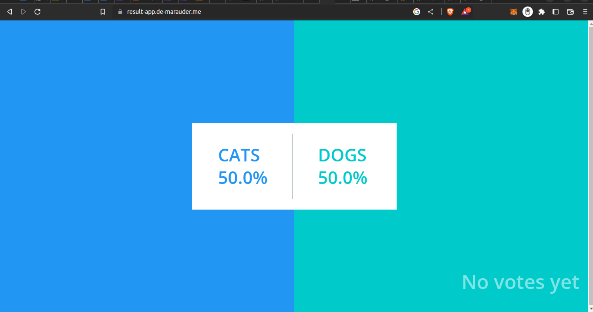
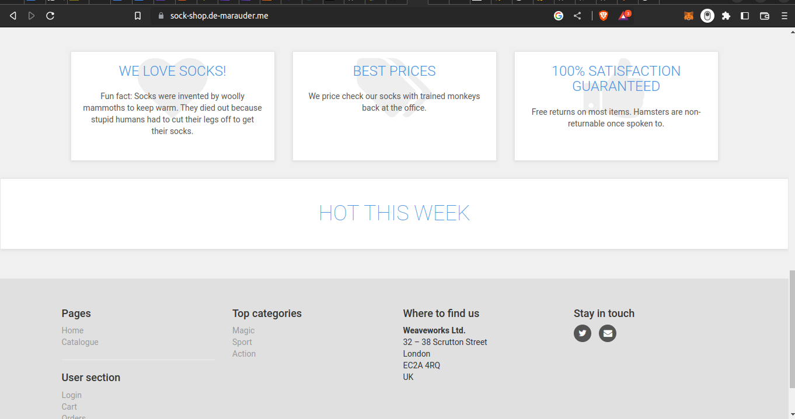
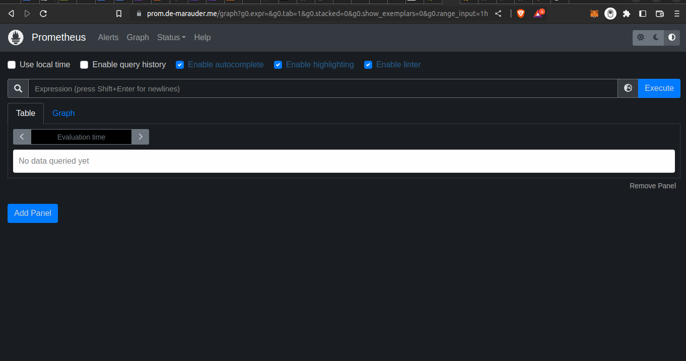
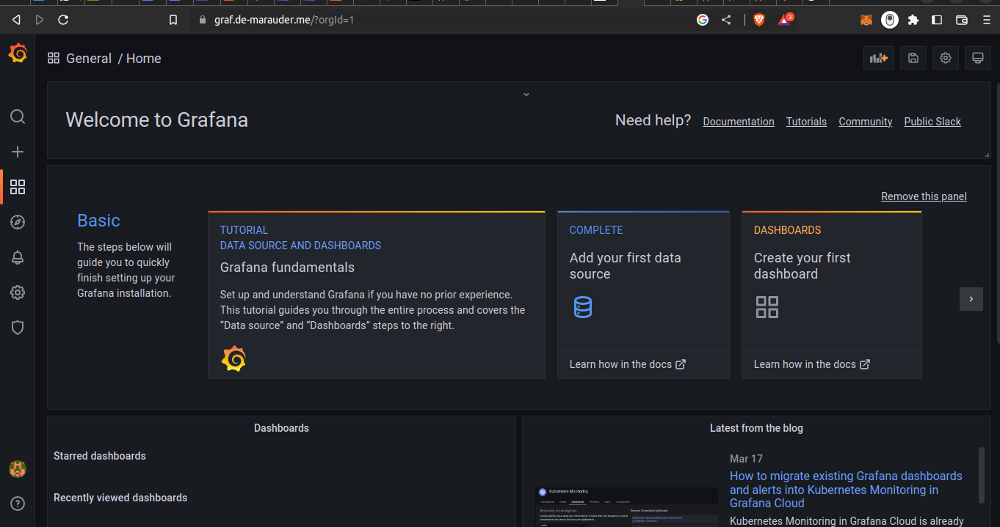

# This repo contains all components for the setup of a kubernetes cluster running three separate applications each with their various services. 
The application include:
- My portfolio: [de-marauder.me](de-marauder.me)
- A voting application on [vote-app.de-marauder.me](vote-app.de-marauder.me) and [result-app.de-marauder.me](result-app.de-marauder.me)
- The weaveworks sock shop application on [sock-shop.de-marauder.me](sock-shop.de-marauder.me)

# Continous Integration & Continous Deployment (CI/CD) 
This was setup using github actions

# Monitoring and logging
Monitoring and loging were implented using prometheus, grafana and loki
- Prometheus at [prom.de-marauder.me](prom.de-marauder.me)
- Grafana at [graf.de-marauder.me](graf.de-marauder.me)

# Infrastructure as Code (IAC)
Implemented with terraform and can be viewed [here](./terraform)
# Results

